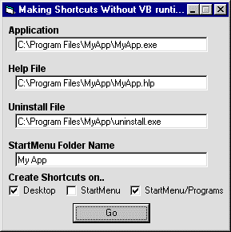



## Shortcut Maker \(without VB6STKIT\)

### Description

Here is a way to make real shortcuts wherever you want them without having to use VB6STKIT. This example shows you how to make a shortcut for an application, helpfile, and uninstall program to the desktop, startmenu, or in startmenu/programs.

If you like, please vote!
 
### More Info
 

             |
---                |---
**Submitted On**   |2002-03-03 03:27:46
**By**             |[Johneboy](https://github.com/Planet-Source-Code/PSCIndex/blob/master/ByAuthor/johneboy.md)
**Level**          |Beginner
**User Rating**    |4.8 (19 globes from 4 users)
**Compatibility**  |VB 6\.0
**Category**       |[VB function enhancement](https://github.com/Planet-Source-Code/PSCIndex/blob/master/ByCategory/vb-function-enhancement__1-25.md)
**World**          |[Visual Basic](https://github.com/Planet-Source-Code/PSCIndex/blob/master/ByWorld/visual-basic.md)
**Archive File**   |[Shortcut\_M59003332002\.zip](https://github.com/Planet-Source-Code/johneboy-shortcut-maker-without-vb6stkit__1-32290/archive/master.zip)

